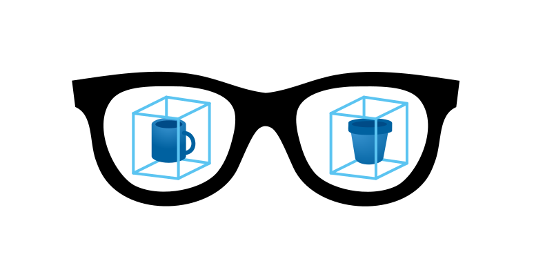
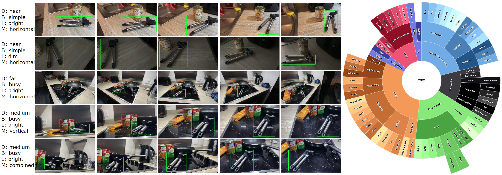

#  EgoObjects API

EgoObjects is a large-scale egocentric dataset for fine-grained object understanding, which features videos captured by various wearable devices at worldwide locations, objects from a diverse set of categories commonly seen in indoor environments, and videos of the same object instance captured under diverse conditions. The dataset supports both the conventional category-level as well as the novel instance-level object detection task.



## EgoObjects v1.0

For this release, we have annotated 114K frames (79K train, 5.7K val, 29.5K test) sampled from 9K+ videos collected by 250 participants across the world. A total of 14.4K unique object instances from 368 categories are annotated. Among them, there are 1.3K main object instances from 206 categories and 13.1K secondary object instances (i.e., objects accompanying the main object) from 353 categories. On average, each image is annotated with 5.6 instances from 4.8 categories, and each object instance appears in 44.8 images, which ensures diverse viewing directions for the object. 

Release v1.0 is publicly available. Images (~40G) can be downloaded from [link](https://scontent-sjc3-1.xx.fbcdn.net/m1/v/t6/An8hVtaVFSLA4yMZFPktRgsXzMN0lbpzHWAXmD3nHmtOt0pV9u5aUW2XbTTDB2w4MgEFSWAjPz34t0chIVdMaGXDIBZ2xPGqicVHKcd1wMqEy76lMac.zip?ccb=10-5&oh=00_AfA0wAxSmMRo7uo21eBy76ABaMK84r36VWZ0faHb2M2SLA&oe=6503523E&_nc_sid=a7aa5b). Unified annotations for category and instance level object detection can be downloaded from links including [train](https://scontent-sjc3-1.xx.fbcdn.net/m1/v/t6/An-WS2mQvnrkM05xVRmd4NwzvUG42KxJV294Caeos-c0h8-XkxRyU9m4AdDvW5x9Sgxi4xHcXHkVkk0JyKtRZCmwCyw04Z-0ulrwQNAayOqnMvDkJvhL3nKJgtcUrA.json?ccb=10-5&oh=00_AfDkZYF6uVC8t6Mk_74ch_Y0y7r4HV8VpCMlyculohLogQ&oe=6500D9FC&_nc_sid=a7aa5b), [eval](https://scontent-sjc3-1.xx.fbcdn.net/m1/v/t6/An8ggk-BJQsp9pd3ra7o4f-xVlvsiNOzF7zrMHk124kuRtX_q5k3bMeO5t0LnG3LEEJuHLKZhKOYjQj7WB4dVnOtkTBG5cV4_9E4vv1KznH6Mt9SXAaTjbzJKrs.json?ccb=10-5&oh=00_AfDjh5CkzHUw57Axy86H-DQ7jFHy_a5l5x_8hTZ6CBGNjg&oe=6500CF45&_nc_sid=a7aa5b), and [metadata](https://scontent-sjc3-1.xx.fbcdn.net/m1/v/t6/An8K4G08lXqX2Om6ZxT8yc0w9oEoqNjimpfZSGFLENsvJ3xB4nuKak0A762P82rRnwptKSXdgwHQm1cdHgKqRu2tTsutxrPfiz_kApnl3AmOSQNiU2njLSlnjxlI.json?ccb=10-5&oh=00_AfD-MWI-SWH57d39SeSyCy1OmhzEGLNgg89IWMw8jGHnbg&oe=6500EC3B&_nc_sid=a7aa5b). They can be placed under `$EgoObjects_ROOT/data/`. We follow the same data format as [LVIS](https://www.lvisdataset.org/dataset) with EgoObjects specific changes.

## Setup

### Requirements
- Linux with Python ≥ 3.8
- PyTorch ≥ 1.8.
  Install them together at [pytorch.org](https://pytorch.org) to make sure of this. Note, please check
  PyTorch version matches that is required by Detectron2.
- Detectron2: follow [Detectron2 installation instructions](https://detectron2.readthedocs.io/tutorials/install.html).

### Example conda environment setup
```bash
conda create --name egoobjects python=3.9
conda activate egoobjects
conda install pytorch torchvision torchaudio pytorch-cuda=11.7 -c pytorch -c nvidia
python -m pip install 'git+https://github.com/facebookresearch/detectron2.git'

# under your working directory
git clone https://github.com/facebookresearch/EgoObjects.git
cd EgoObjects
```

If setup correctly, run our evaluation example code to get mock results for category and instance level detection tasks:
```bash
python example.py
```

## Citing EgoObjects

If you find this code/data useful in your research then please cite our paper:
```
@inproceedings{zhu2023egoobjects,
  title={EgoObjects: A Large-Scale Egocentric Dataset for Fine-Grained Object Understanding},
  author={Zhu, Chenchen and Xiao, Fanyi and Alvarado, Andrés and Babaei, Yasmine and Hu, Jiabo and El-Mohri, Hichem and Chang, Sean and Sumbaly, Rosham and Yan, Zhicheng},
  booktitle={Proceedings of the IEEE/CVF International Conference on Computer Vision (ICCV)},
  year={2023}
}
```

## Credit
The code is a re-write of PythonAPI for [LVIS](https://github.com/lvis-dataset/lvis-api).
The core functionality is the same with EgoObjects specific changes.

## License
EgoObjects is licensed under the [MIT License](LICENSE).